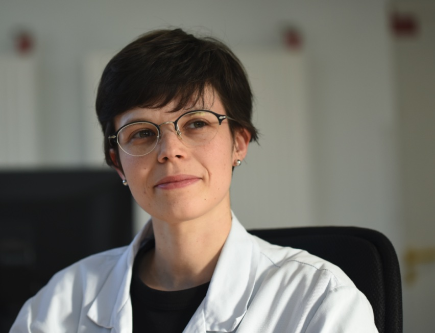

# Dr. Pauline Lallemant-Dudek - Curriculum Vitae

**Email** : pauline.lallemant@gmail.com  
**N° RPPS** : 10101093945  
**Date de naissance** : 5 mai 1987, Chartres (France)

---

## 🧑‍⚕️ Poste actuel

- **Depuis sept. 2023** : Professeur associé - Praticien hospitalier, Sorbonne Université (Paris)
- **Depuis oct. 2020** : Cheffe de service - Médecine Physique et Réadaptation Pédiatrique, Hôpital Armand Trousseau (APHP)

---

## 🧑‍💼 Postes précédents

- **Mars 2021** : Co-directrice médicale, plateforme de transition "ESCALE", Hôpital Armand Trousseau (APHP)
- **Sept. 2020** : Praticien hospitalier universitaire (PMR pédiatrique), Hôpital Armand Trousseau (APHP), Sorbonne Université
- **2016 - 2019** : Chef de clinique, PMR pédiatrique, Hôpital Armand Trousseau (APHP), Sorbonne Université
- **2011 - 2016** : Interne en médecine, spécialisation en PMR, Université Paris Descartes

---

## 🎓 Formation

- **Déc. 2024** : Doctorat en neurosciences, ICM - Équipe "Neurogénétique de la motricité" (Pr A. Dürr)
- **2022 - 2023** : DU Pédagogie médicale, Sorbonne Université
- **Nov. 2022** : Certification Bonnes Pratiques Cliniques
- **Oct. 2022** : Formation de coordonnateur en ETP, AP-HP
- **2019 - 2020** : DIU Maladies génétiques (Université de Paris)
- **2018 - 2019** : DIU Neuro-urologie, Sorbonne Université
- **Oct. 2016** : Doctorat en Médecine, Université Paris Descartes
- **Juin 2016** : DES Médecine Physique et Réadaptation
- **2013 - 2014** : Master Ingénierie Biomédicale, ENSAM / Paris Descartes
- **2005 - 2011** : Études de médecine, Université François Rabelais (Tours)
- **2005** : Baccalauréat scientifique, mention Bien

---

## 🎓 Responsabilités pédagogiques

- **Depuis sept. 2023** : Responsable de l’UE "santé, maladie, handicap", IFMS - Sorbonne Université
- **Depuis sept. 2023** : Responsable du comité pédagogique du DU Orthèses, Sorbonne Université
- **Depuis 2018** : Co-organisation du module pédiatrie du DES de MPR

---

## 📘 Enseignement

> +60 heures/an pour étudiants en médecine et médecins, notamment dans les DU :
- PMR pédiatrique
- Dysraphismes spinaux
- Neuro-urologie
- Urodynamique
- Orthèses

---

## 📚 Publications

### Publications scientifiques majeures (extrait)

1. *Outcome of Children With Prenatally Diagnosed Saccular Limited Dorsal Myeloschisis*, Prenatal Diagnosis, 2025  
2. *Hereditary Spastic Paraplegias: bladder dysfunction?*, Eur. J. of Neurology, 2025  
3. *Upper limb kinematics in neonatal brachial plexus palsy*, Clinical Biomechanics, 2025  
*(et plus de 25 autres, voir fichier complet)*

### Ouvrages pédagogiques

- Coéditrice : *Handicaps et rééducation de l’enfant*, Elsevier, 2025  
- Auteure de chapitres :
  - *Dysraphismes spinaux*
  - *Enfants et bilan urodynamique*
  - *Troubles vésico-sphinctériens en pathologie neurologique*

---

## 👩‍🔬 Affiliations scientifiques

- Comité Urologie de l’enfant (AFU), depuis 2024
- Comité scientifique du congrès SFERHE, 2024
- Groupe d’étude neuro-urologique francophone (GENULF), depuis 2022
- SOFMER et SFERHE, depuis 2017

---

## 🏅 Bourses et distinctions

- **Nov. 2023** : Contrat Sorbonne Université – étude Walk-up (10 000 €)
- **Sept. 2021** : Bourse Brainteam – maladies rares (50 000 €)
- **Oct. 2019** : Bourse SOFMER - IPSEN
- **Nov. 2016** : Prix de thèse ASBH

---

## 🗣️ Communications orales (extraits)

- *Paraparésies spastiques héréditaires et troubles vésico-sphinctériens*, SOFMER Toulouse, 2024  
- *BUD en pédiatrie*, SIFUD 2023 & 2024  
- *Myéloméningocèle et cellules souches*, BJOG, 2023  
- *Modifspa : facteurs environnementaux*, ERN-RND, 2022  
*(et plus de 30 autres)*

---

## 🎤 Modérations de sessions

- 2025 : Colloque Les Massues, Lyon  
- 2024 : SOFMER, Toulouse  
- 2023 : SOFMER, Le Havre  
- 2019 : SOFMER, Bordeaux  
- 2018 : ISPRM, Paris  

---

## 🎓 Encadrement de thèses

- 6 thèses encadrées (MPR, chirurgie pédiatrique) sur :  
  - Dysraphismes spinaux  
  - Vessie neurologique  
  - Ostéogenèse imparfaite  
  - Continence chez l’enfant

---

## 💊 Collaboration avec l'industrie pharmaceutique

- Comités de lancement pour nouvelles indications thérapeutiques  
- Formation à l’injection de toxine botulique intramusculaire

---

~~~python
import os,time
~~~
